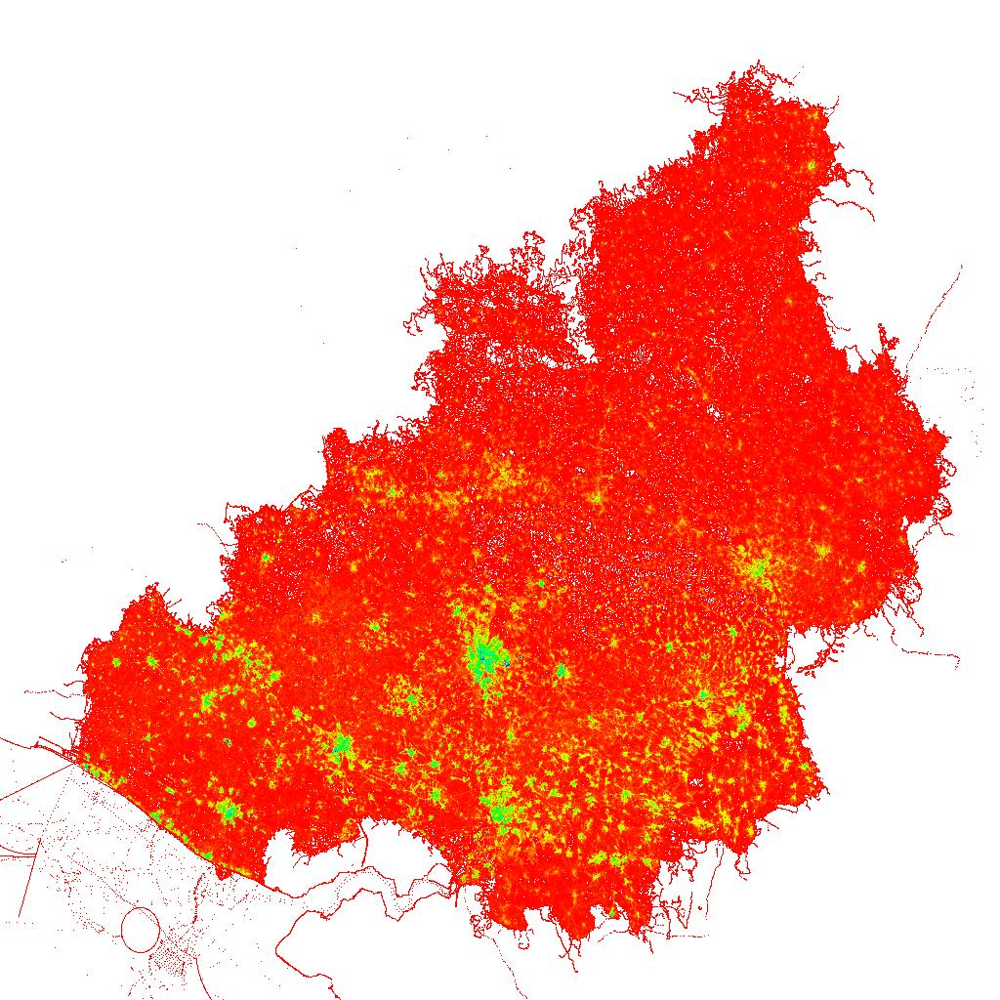

OSM2Picture
===========

Small utitlity to convert an OSM (PBF) file to a JPEG image. Each pixel represents the density of Openstreet map data.

This tools uses Python for rendering. Most of the openstreet map data
is parsed in C++ using libOSMIUM for performance reasons.

Currently select a raster that envelops Belgium. This is configured in
the python code.

Requirements:
* libosmium: for OpenStreetMap processing



Building and running:
```
$ make
$ python render.py <...pbf> 
```
The result is written to result.jpg.

Openstreet map files can be found at [Planet osm](https://wiki.openstreetmap.org/wiki/Planet.osm). These files are processed
at about ~20 MByte/s. On larger files it can thus take a significant amount of time to process it all.


