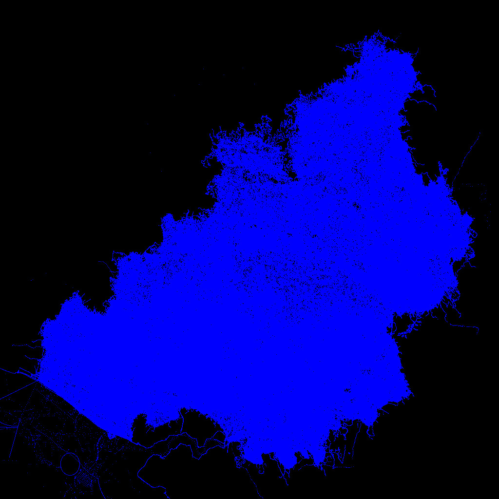

OSM2Picture
===========

Small utitlity to convert an OSM XML file to an PPM image.
Data can be read in from either an XML file or stdin.

Requirements:
* libexpat-dev: for XML processing



Building and running:
```
$ make
$ bzcat belgium-latest.osm.bz2 |./OSM2Picture
```

Openstreet map files can be found at [Planet osm](https://wiki.openstreetmap.org/wiki/Planet.osm)

The result is written to test.ppm. Converting these files to a more common image format can be 
done with conver (from ImageMagick).

The XML files are processed at about 30 MBytes/s but since these files are huge, it can take a long time for the whole XML to be processed.
