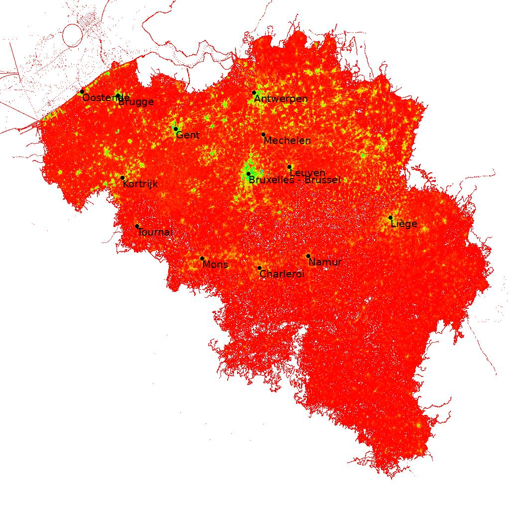

OSM2Picture
===========

Small utitlity to convert an OSM (PBF) file to a JPEG image.

This tools uses Python for rendering. Most of the openstreet map data
is parsed in C++ using libOSMIUM for performance reasons.

Currently select a raster that envelops Belgium. This is configured in
the python code.

Requirements:
* libosmium: for OpenStreetMap processing



Building and running:
```
$ make
$ python render.py <...pbf> 
```

Openstreet map files can be found at [Planet osm](https://wiki.openstreetmap.org/wiki/Planet.osm)

The result is written to test.ppm. Converting these files to a more common image format can be 
done with conver (from ImageMagick).

The XML files are processed at about 30 MBytes/s but since these files are huge, it can take a long time for the whole XML to be processed.
